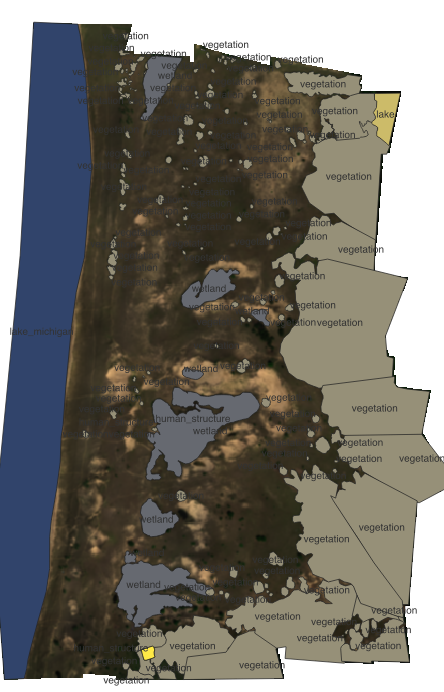

## Mask for drone orthomosaic over Saugatuck Harbor Natural Area (SHNA)

To get started add a sim link to the orthomosaic or make a new copy inside the repository (make sure to add it to .gitignore).

## Classes

ID Class
0 - lake_michigan
1 - wetland
2- vegetation
3- lake
4 - shoreline
5 - sand
6 - human_structure

